# The 24 Beers of Christmas Advent Calendar

## Description

Treat your taste buds during the festive season and explore a new craft beer each day from the 1st to the 24th December. The calendar features winning German beers of the [World Beer Awards](http://www.worldbeerawards.com/), from specialty beers, pale ales, IPAs, dark beers, flavoured beers to stouts and porters.

## Demo

Coming soon!

## Tech stack

- Vue 2
- Vue router
- TypeScript
- Json-server
- uuid
- SCSS
- BEM

## Impressions

**Tablet**

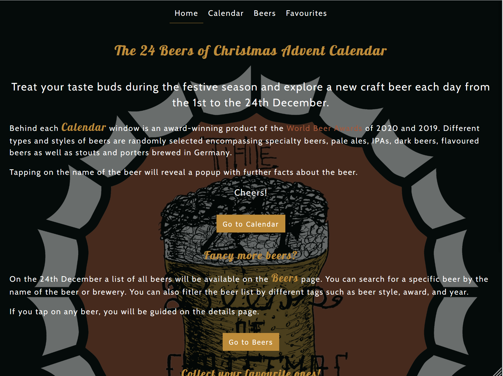 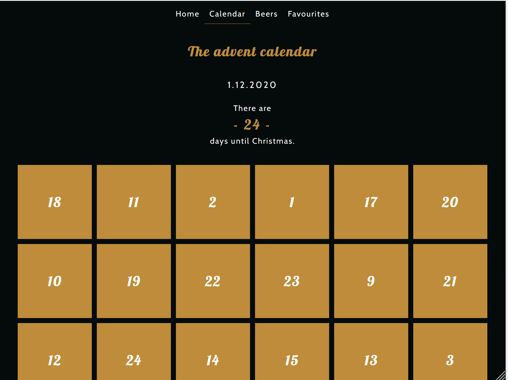 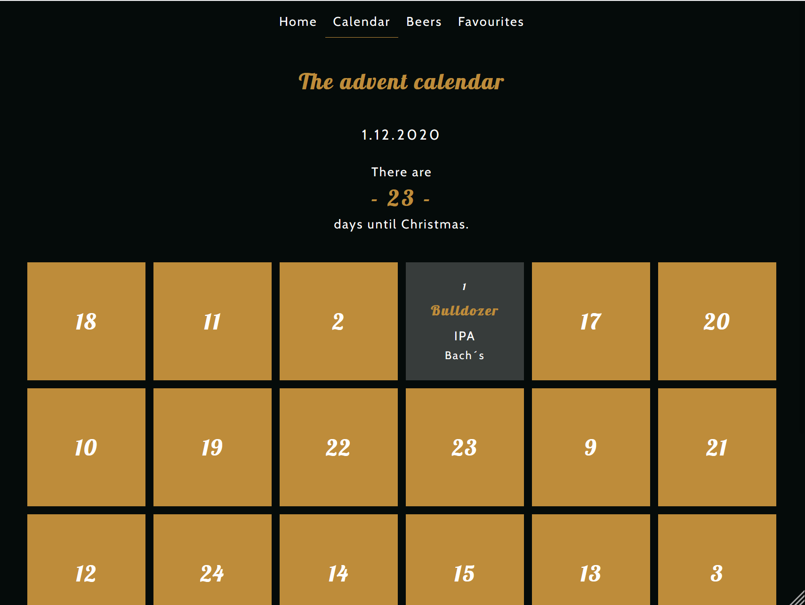 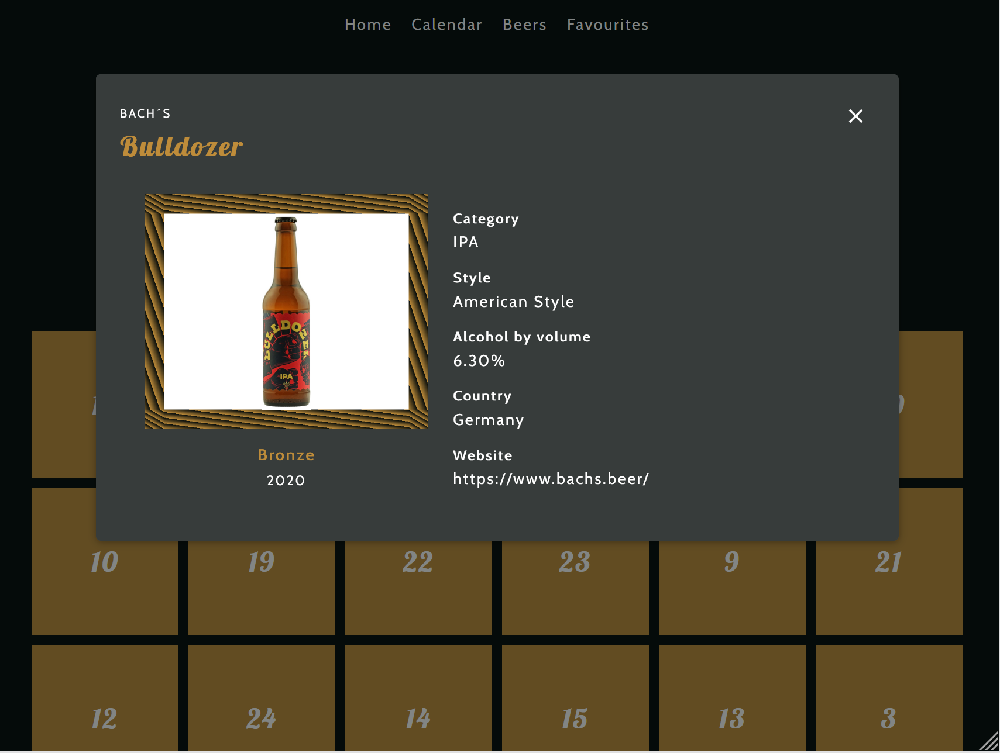 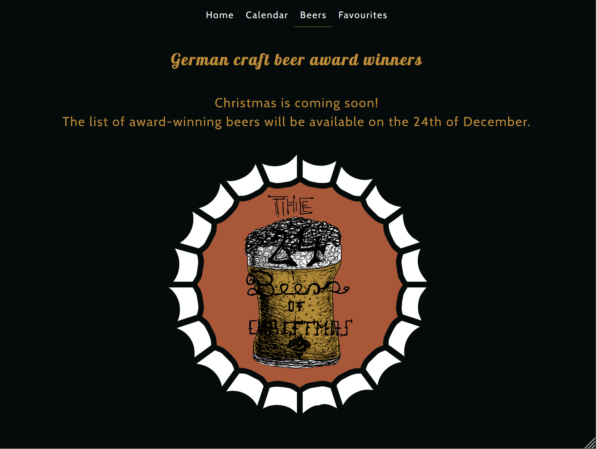 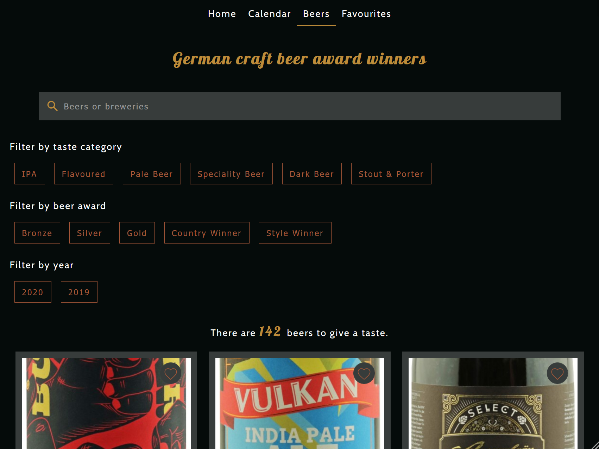 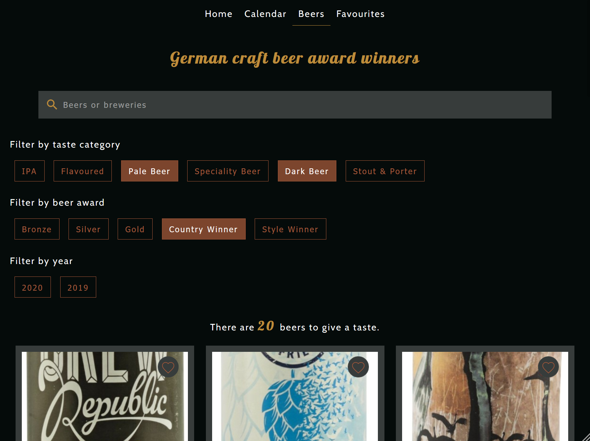 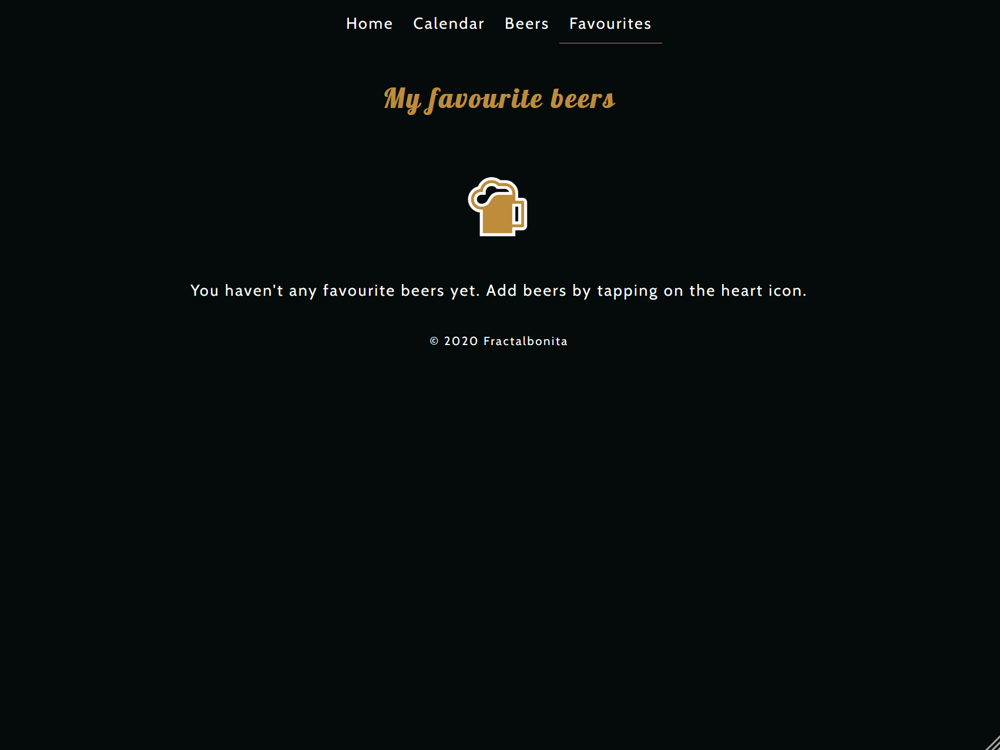

**Mobile**

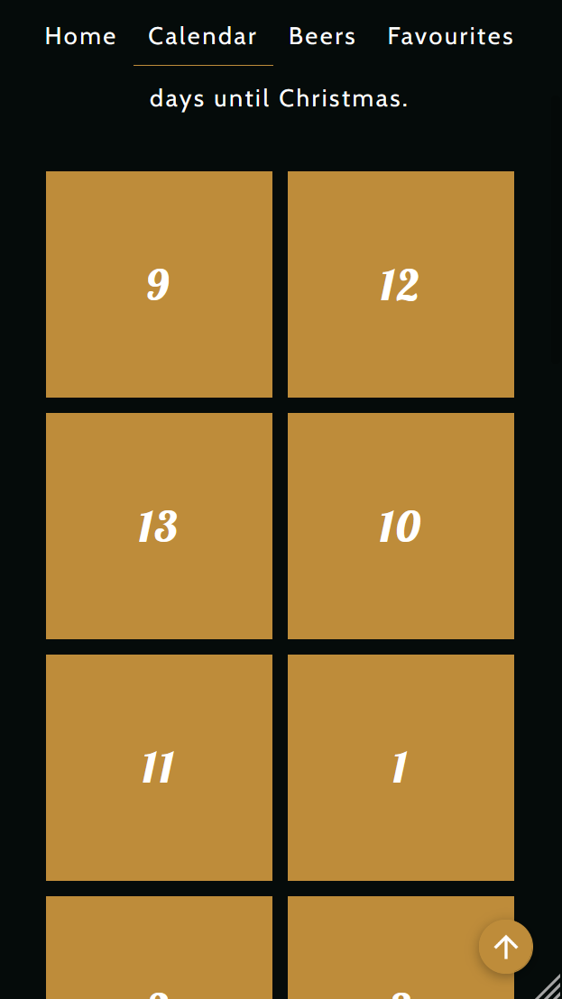 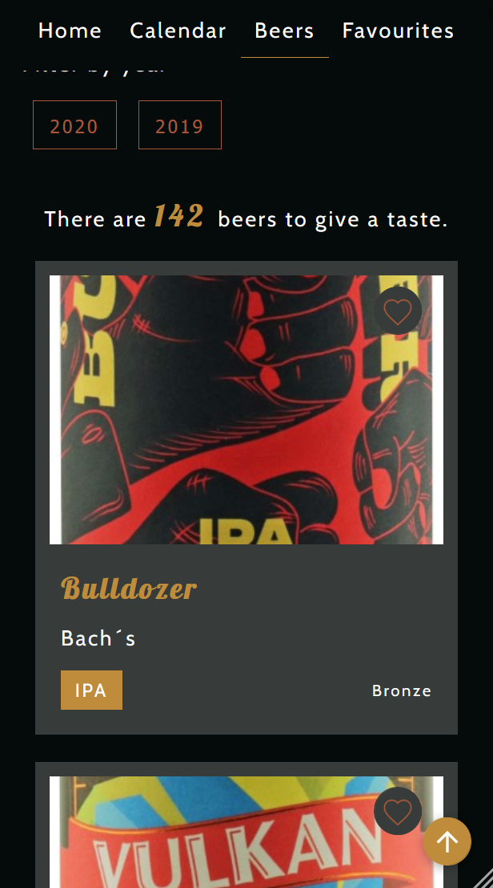 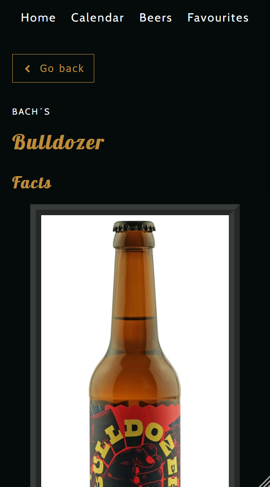 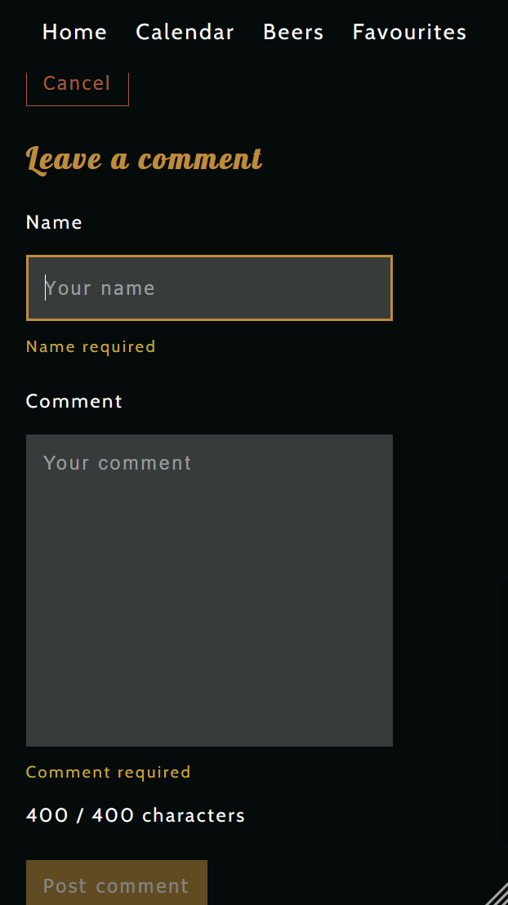 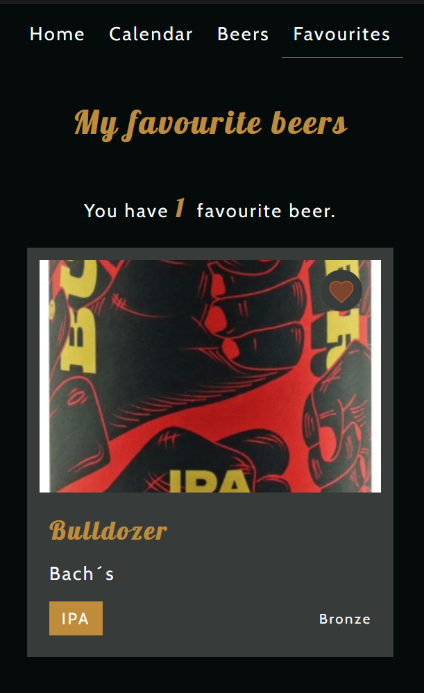

## Project setup

```
yarn install
```

### Compiles and hot-reloads for development

```
yarn serve
```

### Runs server for development

```
yarn mock-server
```

### Compiles and minifies for production

```
yarn build
```

### Lints and fixes files

```
yarn lint
```

### Customize configuration

See [Configuration Reference](https://cli.vuejs.org/config/).
